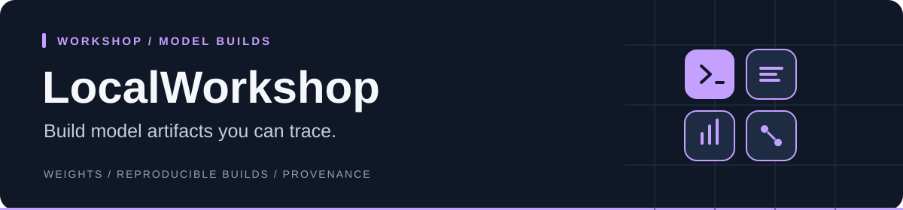

<div align="center">
  <h1>LocalWorkshop</h1>
  <p><strong>Build and modify local model weights, with reproducible scripts and provenance.</strong></p>
  <p><a href="#start-with-a-dry-run">Start here</a> · <a href="docs/README.md">Pipeline guide</a> · <a href="docs/vision.md">Scope &amp; roadmap</a></p>
</div>

LocalWorkshop is a reusable toolkit for **building and modifying local LLM
weights**: abliteration (uncensoring), quantization, conversion, and the
manifests/provenance that keep those artifacts reproducible. It produces GGUF
artifacts and hands them to **LocalBox** for serving — it never serves models
itself.

## Is this the right tool for you?

| Your goal | Best starting point |
|---|---|
| Download and run an existing model | [LocalBox](https://github.com/C0deGeek-dev/LocalBox) |
| Convert or quantize model weights yourself | **LocalWorkshop** |
| Tune a model's runtime settings | [LocalBench](https://github.com/C0deGeek-dev/LocalBench) |

**LocalWorkshop is a script toolkit for model builders.** It is installed and
versioned separately from the apps; `localx install` and `localx update` do not
include it. The current pipeline requires Windows, PowerShell 7+, Python
conversion dependencies, and sufficient storage. CUDA is needed for the
importance-matrix and serving smoke steps. See the [requirements](docs/README.md#requirements).

## Start with a dry run

1. Clone this repository and open PowerShell in its folder.
2. Review [scripts/config.ps1](scripts/config.ps1): model directory, pinned tools,
   source model, and output tiers are configured there.
3. Preview acquisition before downloading model weights:

```powershell
./scripts/acquire.ps1 -DryRun
```

Follow the [pipeline guide](docs/README.md#workflow-1--apex-quantized-gguf-build)
for the actual stages. Every stage supports `-DryRun` so you can inspect the
paths and underlying commands first.

## From checkpoint to runnable model

| Step | Output | Script |
|---|---|---|
| Acquire | Source weights and provenance | [acquire.ps1](scripts/acquire.ps1) |
| Convert | GGUF master and vision projector | [convert.ps1](scripts/convert.ps1) |
| Quantize | APEX deployment tiers | [quantize-apex.ps1](scripts/quantize-apex.ps1) |
| Hand off | Artifact prepared for LocalBox | [serve.ps1](scripts/serve.ps1) |
| Verify | Checksum checked against the manifest | [verify-manifest.ps1](scripts/verify-manifest.ps1) |

Model weights stay outside Git; manifests record where they came from and how
they were built. **Default: local use only.** Model redistribution requires its
own explicit decision and compliance with upstream licenses.

## Quick layout

| Path | What |
|---|---|
| `scripts/` | Pipeline stages + `config.ps1` (single source of pinned revisions + model dir) |
| `manifests/` | One provenance JSON per produced artifact (sha256, size, tool revisions) — the weights-out-of-git substitute |
| `docs/` | README, vision, decision log, model-card template |

**Governance status:** LocalWorkshop is **not** on the coordinated LocalX
release train (it versions independently of the five product repos); its
durable decisions live in `docs/decisions.md`. This repository contains shipped
tooling and its public technical documentation, not internal work tracking.

## License


LocalX-owned tooling and documentation are available under the
[PolyForm Noncommercial License 1.0.0](LICENSE). Commercial use requires a
separate license. Produced or consumed models, datasets, and tools keep their
own upstream terms. See [LICENSING.md](LICENSING.md) and
[THIRD_PARTY_NOTICES.md](THIRD_PARTY_NOTICES.md).
